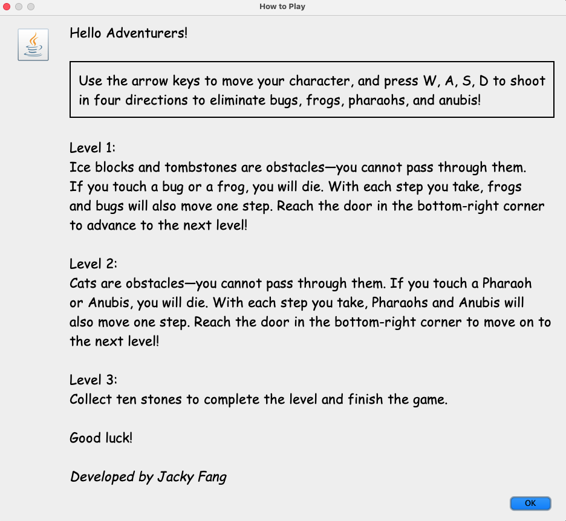
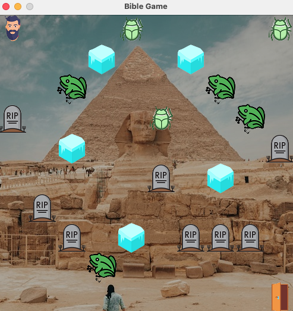
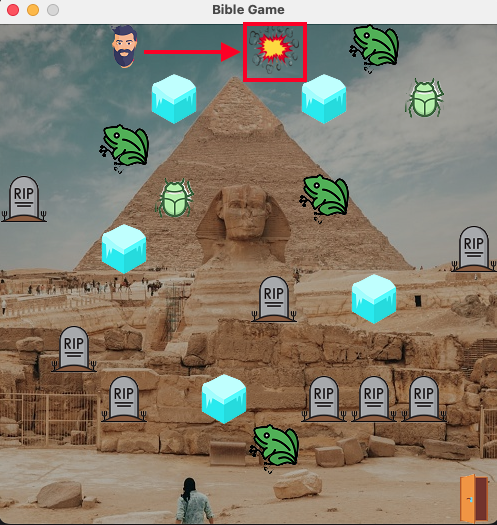
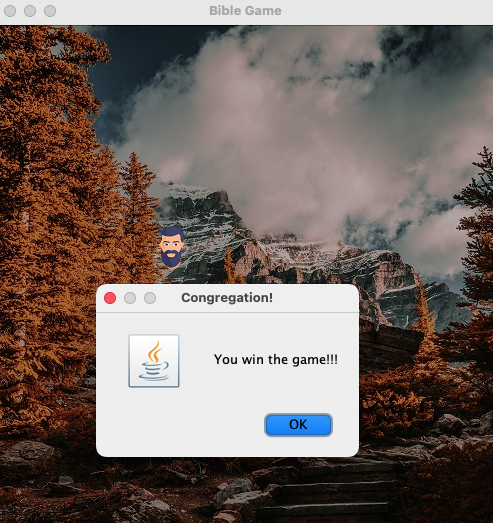
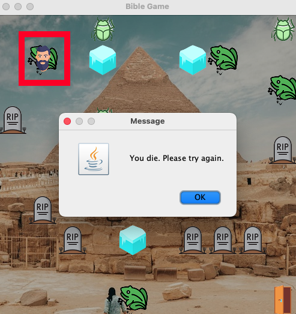

# 🗿 Bible Game 2025

소개
---
이 게임은 성경 출애굽기를 바탕으로 제작되었으며, 재앙, 홍해, 십계명의 세 가지 주요 스테이지로 구성됩니다.

앞의 두 스테이지에서 주인공 모세는 괴물에게 쫓깁니다. 플레이어는 W, A, S, D 키로 이동하고 사격으로 적을 공격할 수 있습니다. 진행을 방해하는 다양한 장애물도 등장합니다. 1·2 스테이지를 클리어하려면 화면 오른쪽 아래에 있는 출구에 도달해 다음 단계로 넘어가야 합니다.

세 번째 스테이지(십계명)의 목표는 돌판 10개를 모두 수집하는 것입니다. 전부 모아야 도전을 완료하고 앞으로 나아갈 수 있습니다!

다운로드
---
[게임 다운로드받기](https://drive.google.com/file/d/1aFMcJnVnGYGYg_l_MiDbyiF1E89Sm2r-/view?usp=sharing)

[JDK 다운로드받기](https://www.oracle.com/java/technologies/downloads/)

    Note:
    위의 ‘게임 다운로드받기’를 눌러 게임 JAR 파일을 내려받으세요. 이 게임은 실행을 위해 JDK가 필요하므로, 컴퓨터에 JDK가 설치되어 있어야 합니다. 
    아직 없다면 링크에서 운영체제에 맞는 아무 버전이나 설치한 뒤 게임을 실행하세요.
    
기술 스택
---

* 백엔드:`Java(Swing for UI)`

사용자 인터페이스
---

#### 게임 규칙:

#### 레벨 1 화면:

#### 레벨 2 화면:

#### 레벨 3 화면:

#### 사격 뷰:

#### 모든 레벨들 클리어:

#### 게임 오버:

