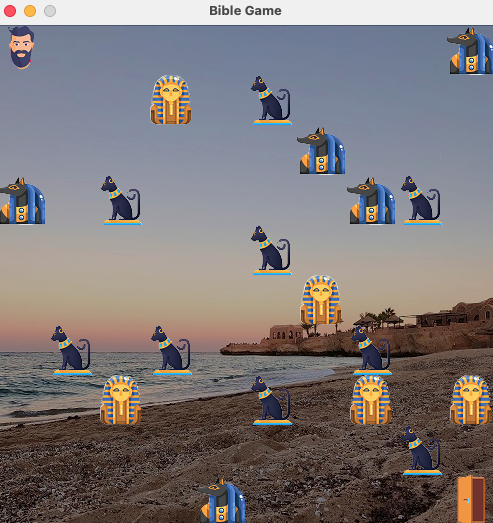
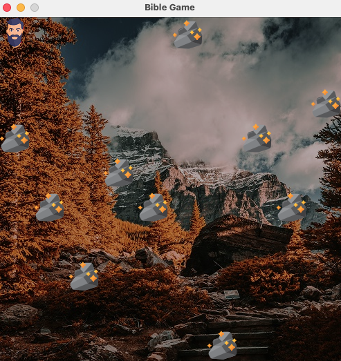

# 🗿 Bible Game 2025

Introduction
---
This game is based on the Book of Exodus from the Bible and consists of three main stages: Plagues, 
the Red Sea, and the Ten Commandments.

In the first two stages, the protagonist, Moses, is chased by monsters. Players can move using 
W, A, S, D and attack enemies by shooting. Various obstacles will also appear to hinder Moses' progress. 
To clear the first and second stages, players must reach the exit at the bottom-right corner to proceed 
to the next level.

In the third stage (Ten Commandments), the objective is to collect all ten stone tablets. Only after 
gathering them all can the player complete the challenge and advance!

Download
---
[Link to Bible Game 2025](https://drive.google.com/file/d/1aFMcJnVnGYGYg_l_MiDbyiF1E89Sm2r-/view?usp=sharing)

[Link to JDK](https://www.oracle.com/java/technologies/downloads/)

    Note:
    Please click the "download link" above to download the game's JAR file. Since this game requires JDK 
    to run, make sure you have it installed on your computer. If you don’t have JDK yet, please download 
    and install it from the link above before running the game. You can download any version of the JDK 
    that is compatible with your operating system.
    
Technology Stack
---

* Backend:`Java(Swing for UI)`

User Interface
---

    
#### Level 1:

#### Level 2:

#### Level 3:

#### Shoot:

#### Pass all the levels:

#### Game Over:

